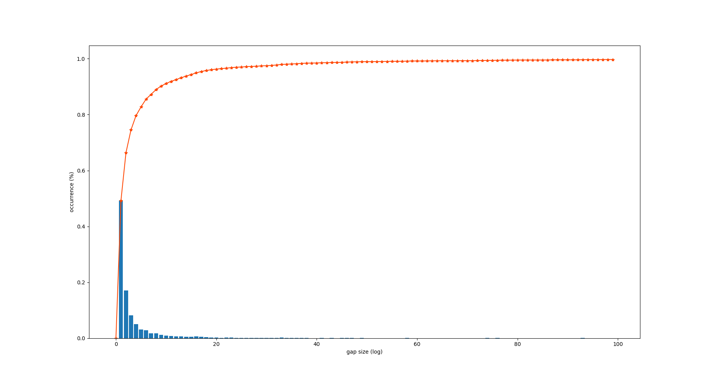

# I3D network implementation

**NOTE:** This project **has been forked** from Srijan Das's [I3D repository](https://github.com/srijandas07/i3d/).

The Toyota SmartHome paper (Das et al. 2019). Describes a Separable spatio-temporal attention (STA) neural network
consisting of two branches, namely an LSTM and an inflated _3D_ convolutional neural network (I3D).

The I3D branch takes the action volumes (XYT data, with RGB information), and produces a convolutional feature which is
then modulated via an attention block that uses skeletal data (output from an LSTM network).

The way the images for this action volumes is cropped changes what this I3D network _sees_, and therefore, preprocessing
of images can be an interesting alternative to improve performance. The original paper uses an SSD network to crop the
images around the detected individual. However, these crops are not provided with the Toyota SmartHome dataset.

In our Sensors paper (Climent-Pérez et al. 2021, _accepted_), we have tried to alternatives with success:

* Using a Mask RCNN instead of an SSD.
* Using 'full crops', i.e. full activity crops where information from all detections is used to create a crop of the
image containing the full activity (i.e. the resulting activity bounding box contains all detections).
  
## Preprocessing scripts

Because the Mask-RCNN, as any other detection network, may fail for some frames during detection, a _gap filling_
technique has been devised. The figure below shows blue bars for the size of identified gaps, showing that almost half
the gaps are 1 frame long (i.e. most are _glitches_). Then the vast majority are
below 1 second of video (approx. 20 frames). And that more than 99% are less than 60 frames in length (orange line shows
cumulative count of the gaps, with convergence to 100%).

This information is then used to perform some preprocessing of the _raw_ detections, and fill in gaps below a threshold
of 60 frames. To do so, we use the information from the last detection rectangle available.

The `preprocessing/` folder contains 6 numbered scripts. Scripts 1 and 2 identify and perform the _filling in_ of the
missing information. These are short descriptions for each of the scripts:

1. `step1_find_gaps.py` is used to determine the existing gaps in detection (i.e. when the Mask RCNN network returned no
   bounding boxes).
2. `step2_fill_gaps.py` is then used to fill in detected gaps, up to a certain size, given certain conditions
   (i.e. the gaps in detection are not found in the beginning or end of a video).
3. `step3_crop_videos.py`, can be used to crop the videos using the new 'filled in' information.
4. `step4_tar_gz_crops.py`, (_optional_) can be used to create `.tgz` files for the sequences, if necessary.
5. `step5_regenerate_splits.py`, takes into account sequences for which there are no detections, and changes the splits
   accordingly.
6. `step6_check_crop_images.py` can be used _optionally_ to check whether the generated images are valid in all cases (non-empty).
   This is useful if the cropping process was interrupted and checks corrupted file contents.

### Step 3 options

The script in `preprocessing/step3_crop_videos.py` contains two functions to crop the videos. One is the _normal_ 
process of cropping a square are around the detected individual. This is called `process_one_video()`.

Furthermore, there is the option to extract full activity crops by instead calling `process_one_video_fullcrop()`.
   
## Other changes

Apart from some code clean-up of unused characteristics (non-local, NL), as well as some other scripts.
As described in our paper, other changes are aimed at learning rate changes required to train in our case.

## References

* **(Das et al. 2019)** Das, S., Dai, R., Koperski, M., Minciullo, L., Garattoni, L., Bremond, F., & Francesca, G. (2019). Toyota smarthome: Real-world activities of daily living. In Proceedings of the IEEE International Conference on Computer Vision (pp. 833-842).
* **(Climent-Pérez et al. 2021, _accepted_)** Climent-Pérez, P., Florez-Revuelta, F. (2021). Improved action recognition with Separable spatio-temporalattention using alternative Skeletal and Video pre-processing, Sensors, _accepted_.
